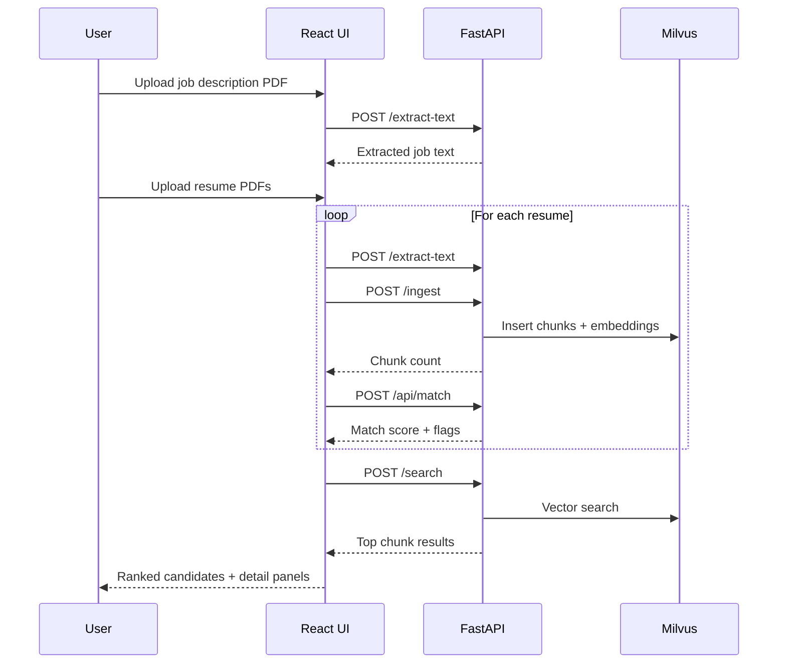

# recruitment-assistant

## Run locally without Docker
1. **Prerequisites**
   - Python 3.10+
   - Node.js 18+ (for the React dashboard)
   - A running Milvus instance (standalone or cloud). You can start a local Milvus quickly with `docker run -d --name milvus-standalone -p 19530:19530 -p 9091:9091 milvusdb/milvus:v2.4.5-20240513-66eae42`.

2. **Backend setup**
   ```bash
   python -m venv .venv
   source .venv/bin/activate
   pip install --upgrade pip
   pip install -r requirements.txt
   
   # required environment variables (set here or via a .env file)
   export OPENAI_API_KEY="<your_api_key>"          # required for the default OpenAI provider
   # export LLM_PROVIDER="gemini"
   # export GEMINI_API_KEY="<your_api_key>"        # required when LLM_PROVIDER=gemini

   # Milvus connection (choose one approach)
   export MILVUS_URI="http://localhost:19530"      # or your remote/cloud endpoint
   # export MILVUS_HOST="localhost"
   # export MILVUS_PORT="19530"
   export MILVUS_TOKEN="<if_required>"             # optional for auth-enabled clusters
   ```

3. **Initialize the Milvus collection**
   ```bash
   python db_init.py
   ```

4. **Run the FastAPI server**
   ```bash
   uvicorn app.main:app --host 0.0.0.0 --port 8000 --reload
   ```

5. **Run the frontend**
   ```bash
   cd frontend
   npm install
   npm run dev -- --host --port 5173
   ```

6. Access the app at `http://localhost:5173` (frontend) with the API at `http://localhost:8000`.

## Run with Docker
> The repository does not ship ready-made Dockerfiles yet. The commands below use published base images to run the stack without installing local dependencies.

1. **Start Milvus (standalone)**
   ```bash
   docker run -d --name milvus-standalone -p 19530:19530 -p 9091:9091 milvusdb/milvus:v2.4.5-20240513-66eae42
   ```

2. **Run the FastAPI backend in a Python container**
   ```bash
   docker run --rm -it \
     -p 8000:8000 \
     -v "$(pwd)":/app \
     -w /app \
     -e OPENAI_API_KEY="<your_api_key>" \
     -e MILVUS_URI="http://host.docker.internal:19530" \
     python:3.11-slim bash -c "pip install --no-cache-dir -r requirements.txt && python db_init.py && uvicorn app.main:app --host 0.0.0.0 --port 8000"
   ```

3. **Run the React frontend in a Node container**
   ```bash
   docker run --rm -it \
     -p 5173:5173 \
     -v "$(pwd)/frontend":/app \
     -w /app \
     node:20-bullseye bash -c "npm install && npm run dev -- --host 0.0.0.0 --port 5173"
   ```

4. Navigate to `http://localhost:5173` to use the UI.

## Frontend logic (React + Vite)
The React UI is a single-page dashboard defined in `frontend/src/App.tsx` and composed of smaller presentational components in `frontend/src/components`.

**High-level data flow**
- The API base URL is read from `VITE_API_BASE_URL` with a fallback of `http://127.0.0.1:8000`.
- Job description input supports both a PDF upload and freeform text:
  - PDF uploads call `POST /extract-text`, normalize whitespace, and populate the textarea.
  - The textarea can be edited directly; it is always the source-of-truth for the run.
- Resume PDFs are processed per file:
  - `POST /extract-text` and `POST /ingest` are called in parallel for each resume.
  - `POST /api/match` is called with a truncated job description + resume text to generate match scores and explanations.
- After all resumes are processed, the UI calls `POST /search` to show the top Milvus semantic results for the job description.

**Normalization and safety limits**
- `cleanWhitespace` compresses input text into a single-space format to reduce prompt noise.
- `MAX_MATCH_TEXT` (4000 chars) caps what is sent to the LLM, and `MAX_DISPLAY_TEXT` (1000 chars) limits the resume excerpt shown in the detail pane.
- `parseMatchResponse` is tolerant to variant JSON keys (`matchScore`, `score`, `match`, etc.) and always returns a safe default shape.

**Candidate modeling**
- Candidate names are derived from the resume filename and then normalized (underscores/dashes → spaces).
- Highlights and skill signals are built from the LLM flags:
  - Up to 5 green flags are mapped to `high` skills, up to 3 red flags map to `low` skills.
  - Labels are trimmed to short, readable tags for the badge and heatmap views.
- Candidates are sorted by match score, the top match becomes the active detail view, and chunk counts are aggregated for the hero metrics.

**UI sections**
- Hero metrics: top score, number of resumes analyzed, total Milvus chunks ingested, and last run time.
- Inputs card: job description upload + text area, resume multi-upload, and the “Run analysis” action.
- Shortlist: `CandidateCard` tiles with match score, badges, highlights, and top flags.
- Match detail: `MatchDetailView` renders job/resume text, glass-box explanation, and a `Heatmap` of skill signals.
- Milvus search: shows the top-scoring chunks from the `/search` endpoint.
- Safety layer: `DiversitySankey` uses synthetic demographics for a demo-only bias funnel and flags groups with higher drop-off.

**State and UX behavior**
- `isRunning` disables the primary action and drives progress/status messaging.
- `statusMessage` and `errorMessage` display success/failure banners.
- `lastRunAt` updates after each completed run for quick recency feedback.

**Component responsibilities**
- `frontend/src/App.tsx`: orchestrates all API calls, normalization, and state aggregation.
- `frontend/src/components/CandidateCard.tsx`: compact candidate summary with badges and score meter.
- `frontend/src/components/MatchDetailView.tsx`: detailed explanation panel + heatmap.
- `frontend/src/components/Heatmap.tsx`: skill signal visualization.
- `frontend/src/components/DiversitySankey.tsx`: mock demographics → Sankey data + warning banner.
- `frontend/src/types.ts`: shared types for candidates, match detail, and skill signals.
- Tests live in `frontend/src/components/__tests__` for the main UI components.

**Frontend dev (optional)**
```bash
cd frontend
npm install

# optional: point to a different API base URL
export VITE_API_BASE_URL="http://127.0.0.1:8000"

npm run dev -- --host --port 5173
```

**Frontend flow diagram**

Note: Mermaid diagrams render in GitHub and other Markdown viewers that support Mermaid.

## Backend logic (FastAPI + Milvus)
The backend lives under `app/` and exposes a small set of endpoints for PDF ingestion, LLM scoring, and semantic search.

**Runtime configuration**
- Settings are defined in `app/core/config.py` via Pydantic `BaseSettings` and can be loaded from `.env`.
- Key settings include:
  - Milvus connection: `MILVUS_URI` or `MILVUS_HOST`/`MILVUS_PORT`, optional `MILVUS_TOKEN`.
  - TLS options: `MILVUS_CA_PEM_PATH`, `MILVUS_SERVER_PEM_PATH`, `MILVUS_SERVER_NAME`, `MILVUS_TLS_INSECURE`.
  - Collection + embedding: `MILVUS_COLLECTION` (default `resumes`), `EMBEDDING_MODEL_NAME` (default `sentence-transformers/all-MiniLM-L6-v2`).
  - Chunking: `CHUNK_SIZE`, `CHUNK_OVERLAP`, `TEXT_CHUNK_MAX_LENGTH` (byte-length guard for Milvus VARCHAR).
  - LLM provider: `LLM_PROVIDER` (`openai` by default), `OPENAI_API_KEY`, `LLM_MODEL`, `GEMINI_API_KEY`, `GEMINI_MODEL`.

**API endpoints (`app/main.py`)**
- `GET /health`: basic status check, returns `{ "status": "ok" }`.
- `POST /extract-text`: accepts a PDF upload, writes it to `/tmp`, extracts text via PyPDF2, returns `{ filename, text }`.
- `POST /ingest`: accepts a PDF upload, extracts + chunks text, embeds it, and inserts into Milvus; returns `{ chunks }`.
- `POST /search`: accepts `{ job_description }`, embeds it, runs a Milvus vector search, returns `{ results }`.
- `POST /api/match`: accepts `{ candidate_profile, job_description }`, calls the LLM, returns the JSON match analysis.
- CORS allows `http://localhost:5173` and `http://127.0.0.1:5173` for the frontend dev server.

**Resume ingestion pipeline (`app/services/ingestion.py`)**
- `extract_text_from_pdf` uses PyPDF2 to concatenate page text into a single string.
- `chunk_text` splits on whitespace tokens with overlap and enforces a max UTF-8 byte length per chunk.
- `ingest_resume`:
  - Uses `SentenceTransformer` to embed each text chunk.
  - Derives the candidate name from the filename stem.
  - Inserts embeddings, text chunks, candidate name, and an empty `skills` list into Milvus.
  - Flushes the collection and returns the created chunks.

**Milvus schema and search (`app/services/milvus_client.py`, `app/services/search.py`)**
- Collection schema:
  - `id` (auto-increment primary key)
  - `embedding` (384-dim float vector)
  - `text_chunk` (VARCHAR, max length `TEXT_CHUNK_MAX_LENGTH`)
  - `candidate_name` (VARCHAR)
  - `skills` (JSON)
- Index: HNSW with COSINE similarity (`M=48`, `efConstruction=200`).
- `search_candidates` embeds the job description, runs a vector search (`ef=64`), and returns labeled chunks like `"Candidate: text"` with the Milvus distance score.

**LLM reasoning (`app/services/reasoning_engine.py`)**
- Builds a prompt that requests:
  - A 0-100 match score
  - A "chain of thought" explanation
  - Green flags and red flags
  - Strict JSON output
- OpenAI path uses `chat.completions.create` with `response_format={"type":"json_object"}`.
- Gemini path uses `google-genai` with `response_mime_type="application/json"`.
- `_parse_json_content` is defensive: it attempts full JSON parsing first, then falls back to extracting the outermost `{ ... }`.

**Initialization and tests**
- `db_init.py` bootstraps the collection and index using the same schema + TLS options.
- Tests live in `tests/` and include service-level coverage for the reasoning + search pipeline.

## Notes
- The backend depends on valid OpenAI or Gemini credentials for LLM reasoning calls.
- Settings can be supplied via `.env` (see `app/core/config.py` for available options).
- Update `MILVUS_URI`/`MILVUS_TOKEN` if you use Zilliz Cloud or an authenticated Milvus deployment.
- Run the test suite locally with `pytest` from the repo root.
